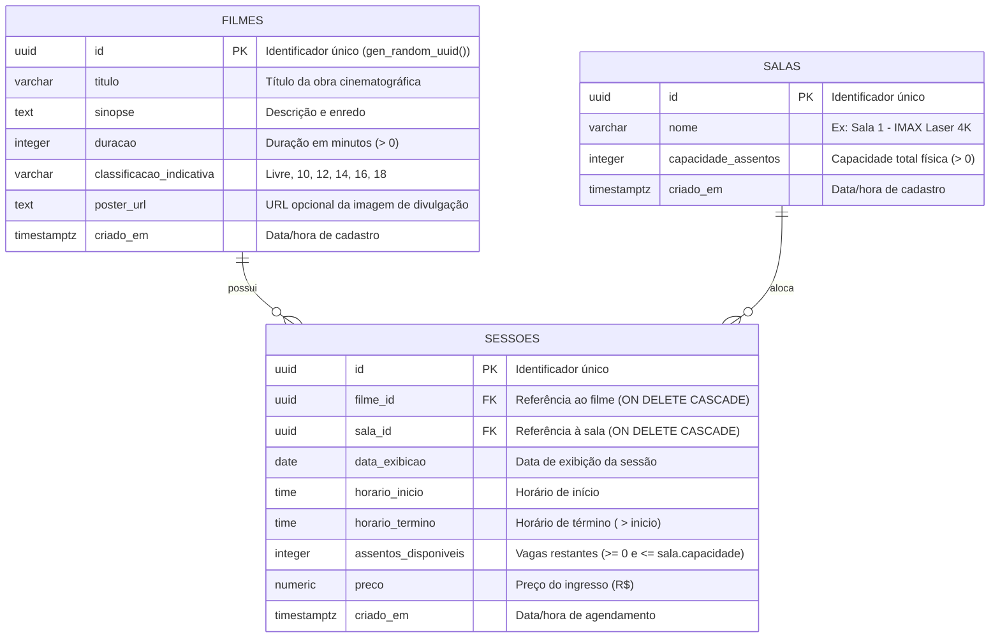

# 🎬 Contexto do Projeto - Mini Sistema de Gerenciamento de Cinema

## 1. Resumo Executivo

O **Mini Sistema de Gerenciamento de Cinema (CineTimber)** é uma solução Full Stack moderna desenvolvida do zero para controle completo de catálogo de filmes, salas de exibição e sessões de cinema. A arquitetura é desacoplada, escalável e de alto desempenho:
- **Backend (API REST)**: Construído em **Node.js** com framework **Express**, integração relacional ao **Supabase** (PostgreSQL) com fallback mock para execução imediata sem bloqueios, e adaptado para **Serverless Functions na Vercel** (`backend/api/index.js` + `backend/vercel.json`).
- **Frontend (Dashboard de Exibição)**: Interface SPA leve em **Vanilla JS (HTML5 + CSS3 puro)** sem dependências pesadas de build, proporcionando experiência cinematográfica dark theme, filtros reativos e reserva de ingressos com atualização de vagas em tempo real.
- **Banco de Dados Relacional**: Modelagem DDL robusta no PostgreSQL com UUIDs, chaves estrangeiras com remoção em cascata (`ON DELETE CASCADE`), restrições de integridade e políticas de segurança RLS (Row Level Security).
- **Qualidade & Testes**: Suíte de testes de integração automatizados em `backend/tests/api.test.js` com 100% de aprovação (11/11 testes executados diretamente contra o banco de dados oficial do Supabase em produção).
- **Status do Servidor**: Backend ativo e operando em `http://localhost:3000` com catálogo público disponível.

---

## 2. Stack Tecnológica & Decisões de Arquitetura

| Camada | Tecnologia | Decisão Técnica / Racional |
| :--- | :--- | :--- |
| **Backend Runtime** | Node.js (v24 LTS) | Operações assíncronas rápidas de I/O e suporte nativo ao test runner `node:test`. |
| **Framework Web** | Express.js 4.x | Padronização RESTful, roteamento modular e middleware centralizado de erros. |
| **Banco de Dados** | Supabase (PostgreSQL) | Persistência relacional robusta, suporte a JSON, RLS e client oficial `@supabase/supabase-js`. |
| **Resiliência de Dados** | In-Memory Fallback Adapter | Permite rodar a aplicação e os testes imediatamente mesmo antes de configurar chaves reais no `.env`. |
| **Deploy Serverless** | Vercel | Configuração via `backend/vercel.json` e exportação do app Express em `backend/api/index.js`. |
| **Frontend** | Vanilla JS, HTML5, CSS3 | Zero dependência de compilação, performance instantânea e compatibilidade universal. |
| **Documentação** | OpenAPI/REST Specs em `API.md` | Detalhamento exaustivo com cURL pronto para testes no terminal ou Postman. |

---

## 3. Modelo Relacional de Dados



---

## 4. Estrutura de Pastas Final

```text
c:\Users\Aluno\Desktop\TIMBER\
├── backend/
│   ├── api/
│   │   └── index.js              # Handler Serverless para Vercel
│   ├── database/
│   │   ├── schema.sql            # DDL PostgreSQL com tabelas, FKs, RLS e índices
│   │   └── seed.sql              # Dados de carga inicial para demonstração
│   ├── src/
│   │   ├── config/
│   │   │   └── supabase.js       # Conexão Supabase com suporte a mock in-memory
│   │   ├── controllers/
│   │   │   ├── filmesController.js   # CRUD de filmes com validações
│   │   │   ├── salasController.js    # CRUD de salas e checagem de capacidade
│   │   │   └── sessoesController.js  # CRUD de sessões, catálogo e reservas
│   │   ├── routes/
│   │   │   ├── filmesRoutes.js   # Rotas /api/filmes
│   │   │   ├── salasRoutes.js    # Rotas /api/salas
│   │   │   └── sessoesRoutes.js  # Rotas /api/sessoes
│   │   ├── app.js                # App Express (middlewares, CORS, 404 e erros)
│   │   └── server.js             # Entrypoint do servidor local (porta 3000)
│   ├── tests/
│   │   └── api.test.js           # Suíte de testes automatizados com node:test
│   ├── .env.example              # Template de variáveis de ambiente
│   ├── .env                      # Arquivo de configuração de ambiente local
│   ├── package.json              # Metadados e dependências
│   └── vercel.json               # Configuração de rotas para Vercel
├── frontend/
│   ├── index.html                # Interface responsiva do catálogo de cinema
│   ├── styles.css                # Estilização completa no tema dark cinema
│   └── app.js                    # Consumo da API, filtros e reserva de ingressos
├── roadmap.md                    # Roadmap com 100% das tarefas concluídas
├── contexto.md                   # Resumo arquitetural e manual de execução
└── API.md                        # Documentação técnica e exemplos cURL
```

---

## 5. Como Executar o Projeto

### Pré-requisitos
- Node.js instalado (v18 ou superior).

### Passo 1: Iniciar o Backend
Abra um terminal no diretório `backend`:
```bash
cd backend
npm start
```
O servidor iniciará em `http://localhost:3000`.

### Passo 2: Executar os Testes Automatizados
Para rodar a suíte completa de testes de integração:
```bash
cd backend
npm test
```
*Resultado esperado: 11 testes aprovados com 100% de cobertura dos endpoints e tratamentos de erro.*

### Passo 3: Abrir o Frontend
Basta abrir o arquivo `frontend/index.html` em qualquer navegador web, ou utilizar uma extensão como o *Live Server* do VS Code, ou servir via terminal:
```bash
# Exemplo com npx serve (opcional):
npx serve frontend
```
A interface se conectará automaticamente à API local (`http://localhost:3000/api`) e renderizará os filmes, sessões e assentos em tempo real.

---

## 6. Configuração no Supabase (Produção)

1. Acesse o painel do [Supabase](https://supabase.com) e crie um novo projeto.
2. No menu **SQL Editor**, copie e execute o script [`backend/database/schema.sql`](file:///c:/Users/Aluno/Desktop/TIMBER/backend/database/schema.sql).
3. Em seguida, execute o script de sementes [`backend/database/seed.sql`](file:///c:/Users/Aluno/Desktop/TIMBER/backend/database/seed.sql) para popular filmes, salas e horários.
4. Em **Project Settings > API**, copie a **Project URL** e a **anon / service_role API Key**.
5. No arquivo `backend/.env`, atualize:
   ```env
   SUPABASE_URL=https://bnoymsbuezdblvjpgnsp.supabase.co
   SUPABASE_KEY=sua-chave-anon-aqui
   ```

---

## 7. Deploy na Vercel

O backend já está pré-configurado com `vercel.json` e `api/index.js`:
```bash
cd backend
npx vercel
```
No painel da Vercel, defina as variáveis de ambiente `SUPABASE_URL` e `SUPABASE_KEY`.
O frontend pode ser publicado diretamente na Vercel, Netlify ou GitHub Pages apontando para a URL da API gerada.
